# Smart Railway Operations & Passenger Management Platform (SmartRail)

A unified, full-stack, enterprise-grade railway management and passenger telemetry ecosystem. Designed to replace fragmented legacy railway systems with a centralized platform for train dispatching, seat inventory, live operational status simulation, digital boarding passes, and role-gated control rooms.

---

## Project Description

Railway operations typically require operators, station staff, and passengers to interact with disparate, disconnected systems for scheduling, seat allocations, cancellations, telemetry, and ticket audits. 

**SmartRail** consolidates these operational workflows into a single end-to-end platform powered by **Node.js, Express, MongoDB, and React**. It features strict Role-Based Access Control (RBAC), atomic seat inventory lifecycle management, complex MongoDB aggregation pipelines for instant PNR retrieval and real-time revenue analytics, and an event-driven live delay simulation and notification engine.

---

## Key Features

- **Dynamic Role-Based Portals**:
  - **Admin Console**: Executive Preclinic-inspired analytics, gross revenue velocity sparklines, booking fulfillment donut charts, and fleet schedule authoring.
  - **Staff Dispatch Desk**: Station master control room, 1-click train status updater (`On Time`, `+15m Delay`, `+45m Delay`, `Departed`, `Arrived`), and verified passenger boarding manifest inspection.
  - **Passenger Travel Portal**: Instant train discovery, live seat quota progress indicators, digital airline-style boarding passes, and personal journey reservation tracking.
- **Atomic Seat Lifecycle Engine**:
  - Reserving a seat immediately decrements available train capacity with negative-inventory protection.
  - Cancelling a ticket immediately restores the berth to the active train pool and logs an audit record with an automated 80% refund computation.
- **High-Performance MongoDB Aggregations**:
  - **PNR Engine**: Unifies `bookings`, `passengers`, and `trains` across multiple collections in a single `$match` + `$lookup` aggregation query.
  - **Analytics Engine**: Real-time revenue summation and status distribution breakdown using `$group` and `$sort`.
- **Live Telemetry & Delay Simulation Engine**:
  - Randomized event progression simulator updating train status and broadcasting real-time operational alerts to all active passenger accounts.
- **Top Elevated Navigation Bar**:
  - Modern, backdrop-blurred top navigation bar with dynamic role-gated tabs, unread notification counter, and secure credential sign-in.

---

## Technologies Used

### Backend Stack
- **Runtime**: Node.js (v18+)
- **Framework**: Express.js (v5)
- **Database**: MongoDB with Mongoose ODM (v9)
- **Security & Auth**: JSON Web Tokens (`jsonwebtoken`), Password Hashing (`bcrypt`)
- **Validation**: Request body sanitation and schema enforcement (`express-validator`)
- **Middleware**: Custom JWT auth middleware, Multi-role RBAC middleware, Central error handling

### Frontend Stack
- **Framework**: React 19 + Vite (v8)
- **Icons**: Lucide React
- **Styling**: Tailored Modern CSS Design System (Custom CSS Tokens, Variables, Sparkline animations, Zero AI-slop layout)
- **Networking**: Native Fetch API with configured Vite reverse proxy to avoid CORS

### Tooling & Environment
- **API Testing**: Postman (Comprehensive Collection included in root)
- **Process Management**: Native background daemons / Vite dev server

---

## Project Structure

```text
Backend_Railway_system/
├── .gitignore                                      # Root gitignore for full monorepo
├── README.md                                       # Comprehensive project documentation
├── CONTRIBUTING.md                                 # Contribution guidelines & code standards
├── LICENSE                                         # MIT License
├── screenshots/                                    # High-resolution screenshots of all features
│   ├── 01_admin_analytics_dashboard.png
│   ├── 02_train_search_and_fleet.png
│   ├── 03_instant_booking_modal.png
│   ├── 04_pnr_status_boarding_pass.png
│   ├── 05_passenger_my_journeys.png
│   ├── 06_live_train_status_telemetry.png
│   ├── 07_staff_operations_control.png
│   ├── 08_passenger_boarding_manifest.png
│   ├── 09_station_hubs_directory.png
│   ├── 10_live_telemetry_notifications.png
│   └── 11_auth_and_role_switcher.png
│
├── backend/                                        # Express REST API Server
│   ├── .env                                        # Environment configuration (Port, Mongo, JWT)
│   ├── package.json                                # Backend dependencies & scripts
│   ├── server.js                                   # Main entry point & route mounting
│   ├── config/
│   │   └── db.js                                   # MongoDB Mongoose connection handler
│   ├── models/                                     # 7 Core MongoDB Mongoose Schemas
│   │   ├── User.js                                 # Users & RBAC roles (admin, staff, passenger)
│   │   ├── Train.js                                # Train schedules, routes, seats & live status
│   │   ├── Station.js                              # Geographic junction hubs & codes
│   │   ├── Passenger.js                            # Detailed passenger profiles
│   │   ├── Booking.js                              # Reservations linked to Train & Passenger
│   │   ├── Cancellation.js                         # Audit trail & 80% refund calculations
│   │   └── Notification.js                         # Operational broadcasts & live alerts
│   ├── controllers/                                # Business logic & controllers
│   │   ├── authController.js                       # Register & Login with JWT & bcrypt
│   │   ├── trainController.js                      # Multi-query train search & seat availability
│   │   ├── stationController.js                    # Station junctions management
│   │   ├── passengerController.js                  # Passenger manifest & directory
│   │   ├── bookingController.js                    # Seat deduction, PNR $lookup & journey history
│   │   ├── cancellationController.js               # Seat restoration & refund engine
│   │   ├── adminController.js                      # Aggregation metrics ($group, $sort)
│   │   ├── statusController.js                     # Live status update & delay simulation
│   │   └── notificationController.js               # User notification feed
│   ├── routes/                                     # Express route definitions
│   │   ├── authRoutes.js                           # /api/auth
│   │   ├── trainRoutes.js                          # /api/trains
│   │   ├── stationRoutes.js                        # /api/stations
│   │   ├── passengerRoutes.js                      # /api/passengers
│   │   ├── bookingRoutes.js                        # /api/bookings
│   │   ├── adminRoutes.js                          # /api/admin
│   │   ├── statusRoutes.js                         # /api/status
│   │   └── notificationRoutes.js                   # /api/notifications
│   └── middleware/                                 # Custom express middlewares
│       ├── authMiddleware.js                       # Bearer JWT token verification
│       ├── roleMiddleware.js                       # Role-based route gating (admin, staff)
│       ├── validationMiddleware.js                 # Express-validator error handler
│       └── errorMiddleware.js                      # Central error & duplicate key handler
│
└── frontend/                                       # React + Vite Single Page Application
    ├── index.html                                  # Root HTML with Google Font typography
    ├── package.json                                # Frontend dependencies
    ├── vite.config.js                              # Vite server & backend reverse proxy
    └── src/
        ├── main.jsx                                # React application bootstrapper
        ├── App.jsx                                 # Master layout, role routing & state
        ├── index.css                               # Global design system & color tokens
        ├── App.css                                 # Preclinic-inspired components styling
        ├── services/
        │   └── api.js                              # Centralized API service with auth tokens
        └── components/
            ├── Navbar.jsx                          # Dynamic elevated top navigation bar
            ├── StatCard.jsx                        # Preclinic-inspired metric cards & sparklines
            ├── TrainSearch.jsx                     # Hero search bar & available train fleet grid
            ├── BookingModal.jsx                    # Instant seat reservation & PNR confirmation
            ├── PnrLookup.jsx                       # Digital airline boarding pass & cancel flow
            ├── PassengerDashboard.jsx              # Passenger travel portal & My Journeys
            ├── StaffDashboard.jsx                  # Station master dispatch desk & manifest
            ├── AdminDashboard.jsx                  # Executive revenue analytics & fleet manager
            ├── LiveStatusBoard.jsx                 # Track telemetry stream & delay simulator
            ├── StationManager.jsx                  # Junction stations directory
            ├── NotificationDrawer.jsx              # Slide-over broadcast alerts drawer
            └── AuthModal.jsx                       # 1-Click demo role switcher & sign in
```

---

## Required Dependencies

### Backend Dependencies
```json
{
  "dependencies": {
    "bcrypt": "^6.0.0",
    "cors": "^2.8.6",
    "dotenv": "^18.0.3",
    "express": "^5.2.1",
    "express-validator": "^7.3.2",
    "jsonwebtoken": "^9.0.3",
    "mongoose": "^9.10.2"
  },
  "devDependencies": {
    "nodemon": "^3.1.14"
  }
}
```

### Frontend Dependencies
```json
{
  "dependencies": {
    "lucide-react": "^1.16.0",
    "react": "^19.0.0",
    "react-dom": "^19.0.0"
  },
  "devDependencies": {
    "@vitejs/plugin-react": "^5.1.0",
    "vite": "^8.3.0"
  }
}
```

---

## Installation & Setup

### 1. Clone & Navigate
```bash
cd Backend_Railway_system
```

### 2. Configure Backend Environment
Ensure `backend/.env` is present with the following keys:
```env
PORT=5001
MONGO_URI=mongodb://localhost:27017/railway_management
JWT_SECRET=railway_secret_key_2026
```

### 3. Install Dependencies
```bash
# Install backend packages
cd backend
npm install

# Install frontend packages
cd ../frontend
npm install
```

---

## How to Run the Application

### Running the Backend
From the `backend/` directory:
```bash
cd backend
node server.js
```
* Backend server boots on: **`http://localhost:5001`**
* Output should verify: `Server running on 5001` and `MongoDB Connected`.

### Running the Frontend
From the `frontend/` directory:
```bash
cd frontend
npm run dev -- --port 5173
```
* Open your browser and navigate to: **`http://localhost:5173`**
* Requests made to `/api/*` are automatically reverse-proxied by Vite to the Express backend on port `5001`.

---

## Database & MongoDB Configuration

The application connects to a MongoDB database named `railway_management`. It operates across **7 relational collections**:

1. **`users`**: User identities, bcrypt hashed credentials, and role enums (`admin`, `staff`, `passenger`).
2. **`trains`**: Train identifier, train name, origin/destination station codes, total seats, available seats, and running status.
3. **`stations`**: Unique station codes (e.g. `NDLS`, `BCT`), junction names, cities, and states.
4. **`passengers`**: Passenger demographics (name, email, age, gender, phone number).
5. **`bookings`**: Active and historical reservations linking `passengerId` and `trainId` with allocated berth, travel date, fare, and status (`Confirmed` / `Cancelled`).
6. **`cancellations`**: Audit log recording timestamp of cancellation, reason, PNR, and calculated 80% refund.
7. **`notifications`**: Live telemetry broadcasts generated on status changes or simulations.

---

## API Endpoint Documentation

All endpoints are prefixed with `/api`. Protected routes require standard `Authorization: Bearer <token>` headers.

### 1. Authentication (`/api/auth`)
| Method | Endpoint | Access | Description |
|---|---|---|---|
| `POST` | `/api/auth/register` | Public | Register new user account (with `express-validator` rules) |
| `POST` | `/api/auth/login` | Public | Authenticate credentials and receive signed JWT token |

### 2. Trains Management (`/api/trains`)
| Method | Endpoint | Access | Description |
|---|---|---|---|
| `GET` | `/api/trains` | Public | Search trains with `?source=...&destination=...&search=...&page=...` |
| `POST` | `/api/trains` | Admin | Register a new train with total seats and route codes |
| `GET` | `/api/trains/:id/seats` | Public | Live telemetry checking `availableSeats`, `totalSeats`, and `status` |
| `PUT` | `/api/trains/:id` | Admin / Staff | Update train attributes |
| `DELETE` | `/api/trains/:id` | Admin | Remove train schedule from fleet |

### 3. Stations Hub (`/api/stations`)
| Method | Endpoint | Access | Description |
|---|---|---|---|
| `GET` | `/api/stations` | Public | Query stations with search filtering and pagination |
| `POST` | `/api/stations` | Admin | Register new station junction code |
| `PUT` | `/api/stations/:id` | Admin | Update station details |
| `DELETE` | `/api/stations/:id` | Admin | Delete station |

### 4. Passenger Directory (`/api/passengers`)
| Method | Endpoint | Access | Description |
|---|---|---|---|
| `POST` | `/api/passengers` | Authenticated | Create passenger profile |
| `GET` | `/api/passengers` | Admin / Staff | View passenger manifest with pagination & search |
| `GET` | `/api/passengers/:id` | Authenticated | Fetch single passenger profile |
| `PUT` | `/api/passengers/:id` | Authenticated | Update passenger profile |
| `DELETE` | `/api/passengers/:id` | Admin | Delete passenger profile |

### 5. Bookings & Cancellations (`/api/bookings`)
| Method | Endpoint | Access | Description |
|---|---|---|---|
| `POST` | `/api/bookings` | Authenticated | Book a ticket; decrements `availableSeats` on train |
| `GET` | `/api/bookings` | Authenticated | Fetch paginated reservation logs |
| `GET` | `/api/bookings/pnr/:pnr` | Public | **Aggregation**: Joins `passengerDetails` and `trainDetails` via `$lookup` |
| `GET` | `/api/bookings/history/:id` | Authenticated | Fetch passenger journey history sorted by `-createdAt` |
| `PUT` | `/api/bookings/cancel/:id` | Authenticated | Cancels ticket, restores seat (`availableSeats++`), and credits 80% refund |

### 6. Admin Analytics (`/api/admin`)
| Method | Endpoint | Access | Description |
|---|---|---|---|
| `GET` | `/api/admin/dashboard` | Admin | **Aggregation**: Aggregates `totalRevenue` and status counts using `$group` & `$sort` |

### 7. Live Telemetry & Simulation (`/api/status` & `/api/notifications`)
| Method | Endpoint | Access | Description |
|---|---|---|---|
| `PUT` | `/api/status/:id` | Admin / Staff | Manually update train status & broadcast notifications |
| `POST` | `/api/status/:id/simulate` | Admin / Staff | **Simulation Engine**: Randomizes live status and broadcasts alerts to all users |
| `GET` | `/api/notifications` | Authenticated | Fetch user notification feed |

---

## Application Preview & Feature Gallery

Explore the comprehensive interface features of SmartRail across passenger, station staff, and operational administration portals.

### 1. Executive Operations & Analytics Console
Comprehensive command center for railway executives featuring Preclinic-inspired KPI telemetry cards, revenue velocity sparklines, fulfillment ratios, and real-time reservation audit logging.

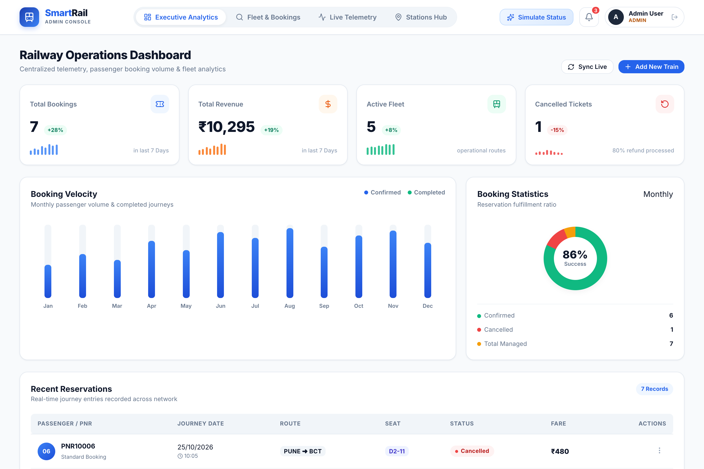

- **Revenue Velocity Tracking**: Visual monthly progression comparing confirmed versus completed bookings.
- **Dynamic KPI StatCards**: Real-time aggregation of active fleet, total revenue, booking counts, and cancellations with 7-day velocity indicators.
- **Reservation Audit Stream**: Live table of all tickets issued across the network with passenger identities, route codes, assigned berths, and ticket status.

---

### 2. Passenger Train Discovery & Available Fleet
Intuitive journey planning portal enabling travelers and operators to search schedules, inspect route endpoints, and monitor seat availability in real time.

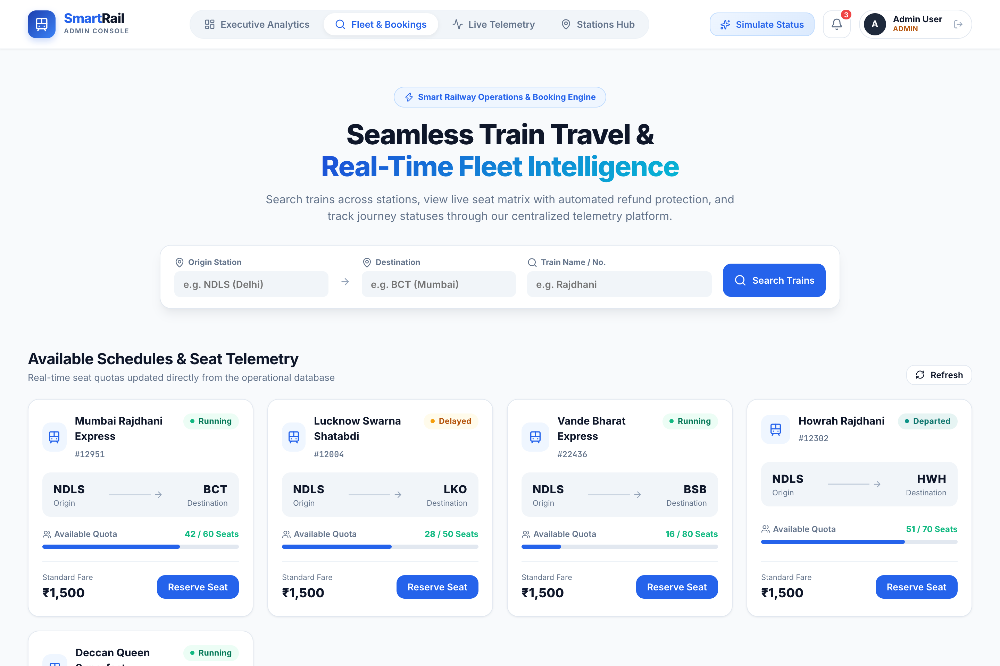

- **Instant Route Filtering**: Filter by origin station, destination terminal, or train name/number.
- **Seat Quota Progress Indicators**: Dynamic color-coded capacity tracks (`Available Quota`) indicating real-time berth availability.
- **Status Badges**: Live indicators (`Running`, `Delayed`, `Departed`) kept in sync with the operational database.

---

### 3. Express Seat Reservation & Berth Allocation
Frictionless ticket reservation modal featuring passenger demographics collection and deterministic IRCTC-style berth allocation.

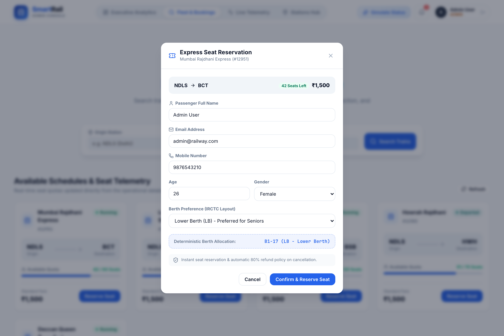

- **Berth Preference Engine**: Select preferred berth type (`Lower Berth`, `Middle Berth`, `Upper Berth`, `Side Lower`, `Side Upper`).
- **Dynamic Allocation Preview**: Instantly calculates coach and seat number (e.g. `B1-17 (LB - Lower Berth)`) before submission.
- **Instant Booking Confirmation**: Generates a unique cryptographic PNR with automatic seat count decrement in MongoDB.

---

### 4. PNR Tracker & Digital Boarding Pass
Airline-style digital boarding pass generated via complex MongoDB multi-collection aggregation pipelines (`$match` + `$lookup`).

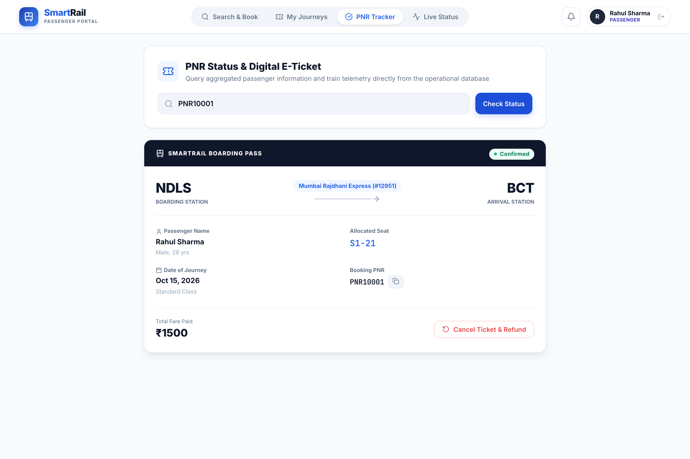

- **Unified Data Aggregation**: Joins passenger demographics, train schedule metadata, and booking records in a single high-performance query.
- **Boarding Pass Metadata**: Displays journey date, boarding station, arrival terminal, allocated berth (`S1-21`), and fare breakdown.
- **1-Click Cancellation & Refund**: Embedded cancellation trigger with immediate 80% refund calculation and seat inventory restoration.

---

### 5. Passenger Travel Portal — My Journeys
Personalized traveler dashboard consolidating active itineraries and historical railway bookings.

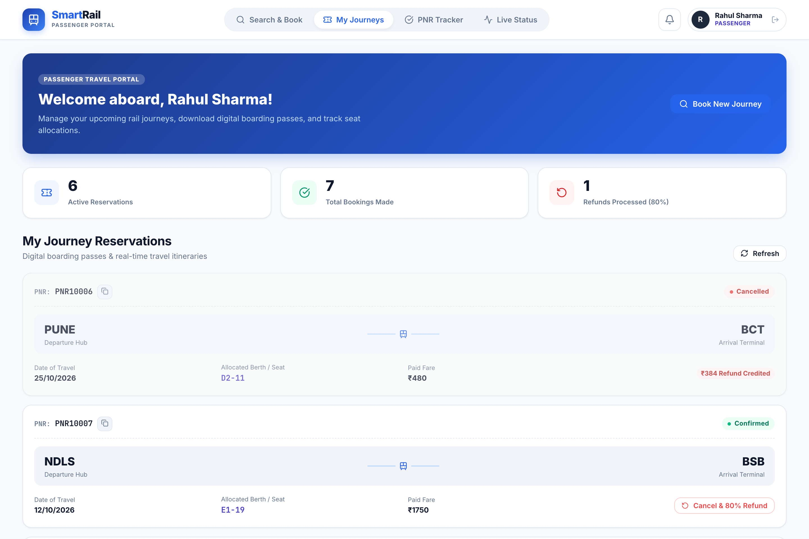

- **Itinerary Management**: Active reservations, completed trips, and cancelled bookings organized with clean status badges.
- **Quick PNR Copying**: One-click clipboard copy for quick sharing or verification.
- **Self-Service Refunds**: Cancel active bookings directly from the itinerary list with instantaneous refund ledgering.

---

### 6. Live Track Telemetry & Delay Simulation Board
Event-driven operations center for monitoring train movements across track segments and simulating real-time operational delays.

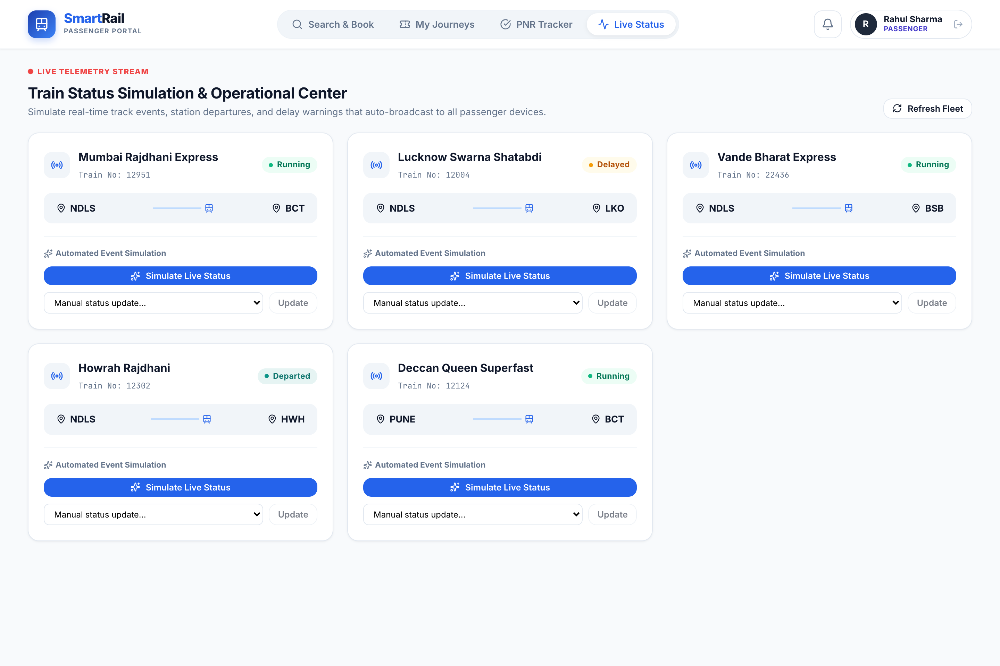

- **Real-Time Signal Status**: Displays running state (`Running`, `Delayed`, `Departed`, `Arrived`).
- **One-Click Event Simulator**: Randomizes realistic operational events and broadcasts telemetry alerts across passenger devices.
- **Manual Dispatch Overrides**: Station masters can override train status directly from dropdown selectors.

---

### 7. Station Staff & TTE Dispatch Desk
Specialized station master and Traveling Ticket Examiner (TTE) workspace tailored for dispatch operations and passenger manifest verification.

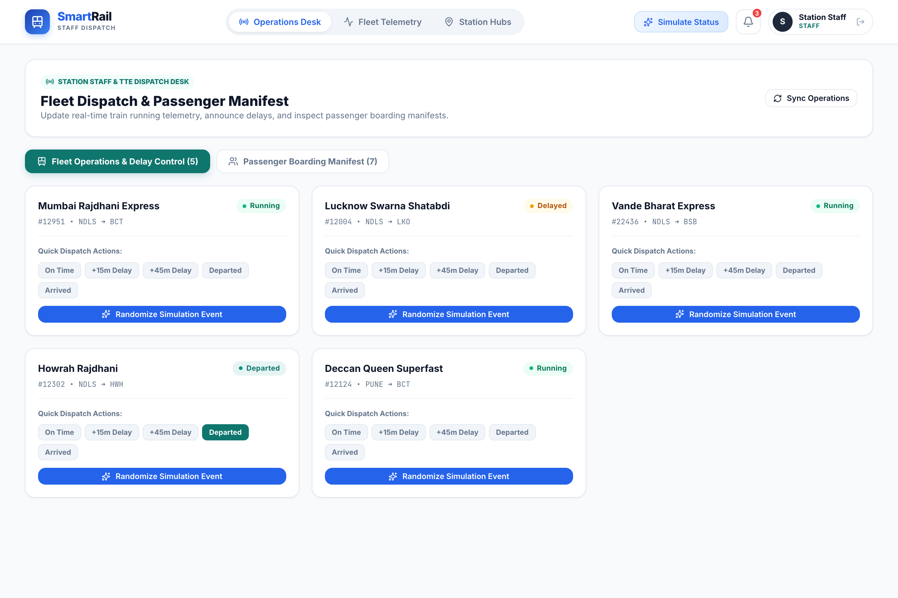

- **Rapid Dispatch Triggers**: 1-click status changers (`On Time`, `+15m Delay`, `+45m Delay`, `Departed`, `Arrived`).
- **Operational Sync**: Instant propagation of station updates to passenger portals and departure displays.

---

### 8. Verified Passenger Boarding Manifest
Searchable, filterable passenger boarding manifest for conductors and station staff.

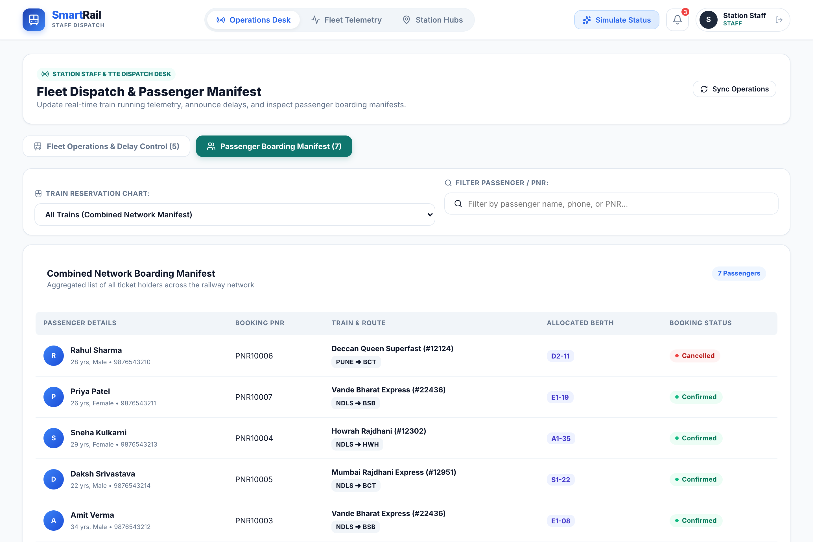

- **Train-Specific Filtering**: Filter passengers by train schedule or view combined network boarding charts.
- **Demographic & Berth Verification**: Inspect passenger age, gender, contact number, allocated berth, and ticket validity (`Confirmed` / `Cancelled`).

---

### 9. Railway Station Directory & Junction Hubs
Centralized junction hub registry displaying operational codes, regional jurisdictions, and active terminal statuses.

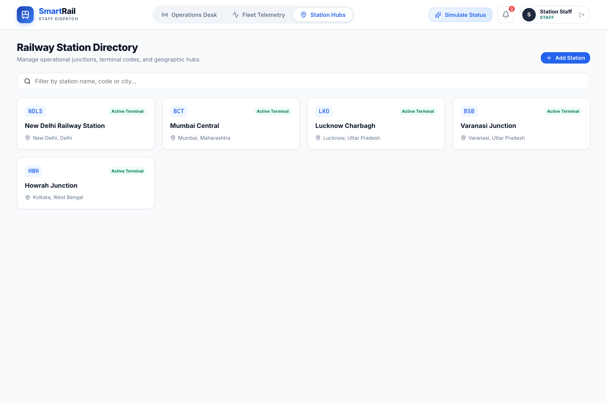

- **Station Registry**: Complete catalog of primary junctions (`NDLS`, `BCT`, `LKO`, `BSB`, `HWH`, etc.).
- **Hub Management**: Author and configure new terminal hubs and geographic connections.

---

### 10. Live Telemetry Alerts & Notification Drawer
Slide-over telemetry broadcast drawer delivering instant, real-time alerts to passengers and operators.

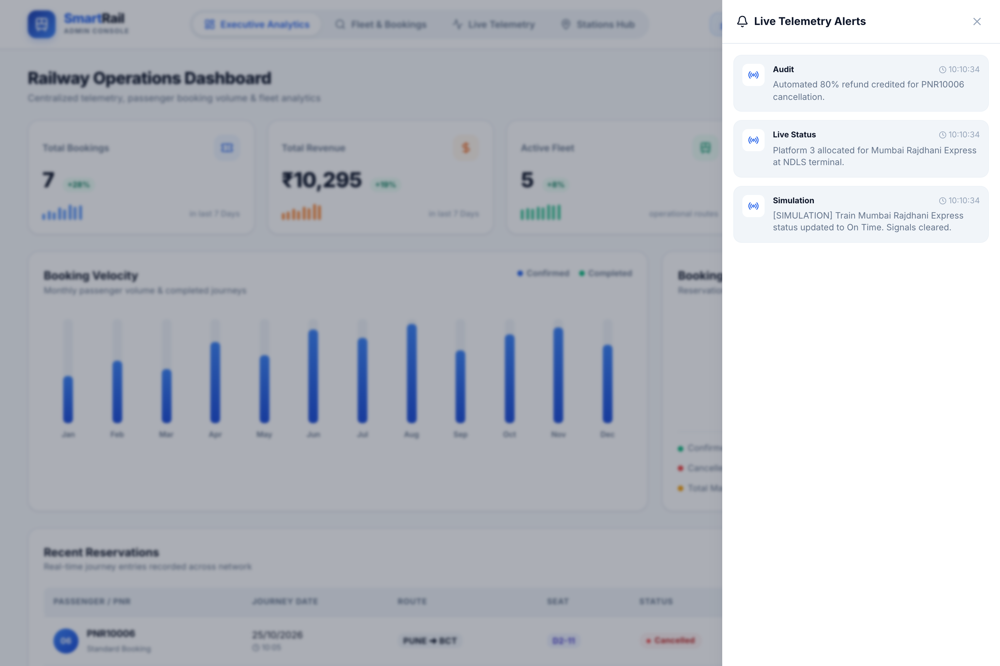

- **Multi-Category Alerts**: Operational delay updates, platform gate assignments, cancellation audit confirmations, and dispatch logs.
- **Time-Stamped Feed**: Real-time timestamped log synchronized via periodic telemetry polling.

---

### 11. Role-Based Access Control & User Authentication
Clean, secure credential-based authentication portal providing tailored access for passengers, station staff, and system administrators.

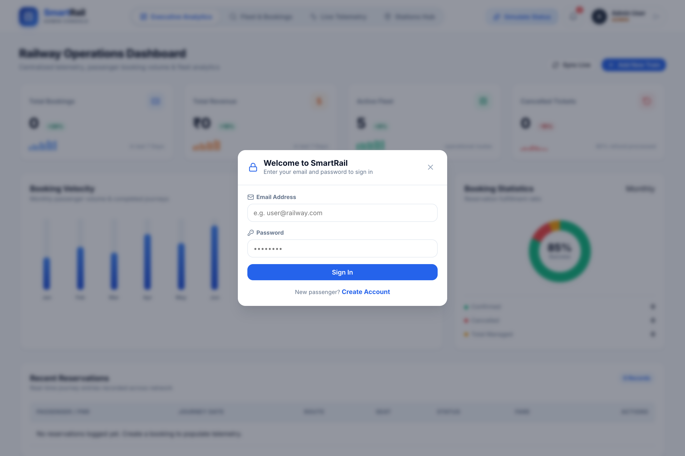

- **Credential-Based Sign In**: Clean and intuitive email address and password input fields.
- **Account Registration & RBAC**: Self-service passenger registration and role assignment.
- **Secure Authentication**: Full JWT-based authorization and session storage with bcrypt-hashed credentials.

---

## Unique Features Implemented

1. **Live Train-Status Simulation & Automated Notification Broadcast Engine**:
   - Rather than relying on static, unchanging data, operators can trigger `/api/status/:id/simulate`. The engine calculates realistic operational status changes (*"Delayed by 15 mins"*, *"Departed from Station"*, *"Arrived"*) and pushes automated broadcast alerts into the notification feeds of all passengers.
2. **High-Performance MongoDB Aggregation Pipelines**:
   - **Multi-Collection PNR Engine**: Replaces inefficient sequential database queries with a unified MongoDB aggregation pipeline using `$match` and `$lookup` to join `bookings`, `passengers`, and `trains` into a single, cohesive boarding pass response.
   - **Real-Time Revenue Analytics**: Aggregates booking totals and computes status distribution via `$group` and `$sort` stages directly within the database engine.
3. **Automated 80% Cancellation Refund & Atomic Inventory Re-allocation**:
   - Immediate seat recovery upon cancellation: ticket status changes to `Cancelled`, the berth is atomically restored to the active train's `availableSeats`, and an audit record is created in `cancellations` recording an 80% refund credit.
4. **Dynamic Role-Gated Portal Architecture**:
   - The top navigation bar, available features, and screens automatically adapt depending on whether the user is logged in as an **Admin**, **Staff**, or **Passenger**:
     - *Passenger*: Accesses personal booking history (*My Journeys*), search, and PNR view with all financial and operational controls hidden.
     - *Staff*: Accesses train dispatching desk, delay updater, and verified passenger manifests with corporate financials hidden.
     - *Admin*: Accesses full executive revenue charts, velocity metrics, and fleet schedule managers.

---

## Important Assumptions & Limitations

1. **Single-Seat Allocation**:
   - The current booking API assigns one passenger berth per booking transaction. Multi-passenger group bookings can be made sequentially.
2. **Notification Polling**:
   - Real-time notification updates are synchronized using an 8-second periodic telemetry fetch over HTTP REST rather than continuous WebSocket connections.
3. **Refund Policy**:
   - The cancellation refund formula is strictly set at 80% of the total ticket fare, with a 20% flat operational deduction.
4. **Payment Gateway**:
   - Fares and refunds are processed through direct database transaction state management; live third-party payment gateways (e.g. Razorpay/Stripe) are not attached to this local build.

---

## Contributing

Contributions to SmartRail are welcome! Please check out [CONTRIBUTING.md](CONTRIBUTING.md) for detailed guidelines on setting up your local environment, coding standards, branching strategies, and submitting pull requests.

---

## License

This project is open-source software licensed under the **MIT License**. See the [LICENSE](LICENSE) file for complete details.

---

## Authors

- **Daksh Srivastava**
- **Yuvraj Mishra**
- **Prathamesh More**
- **Sumit Shingole**
- **Rudra Yadav**

---

*Smart Railway Operations & Passenger Management Platform • Built with Node.js, Express, MongoDB & React*
